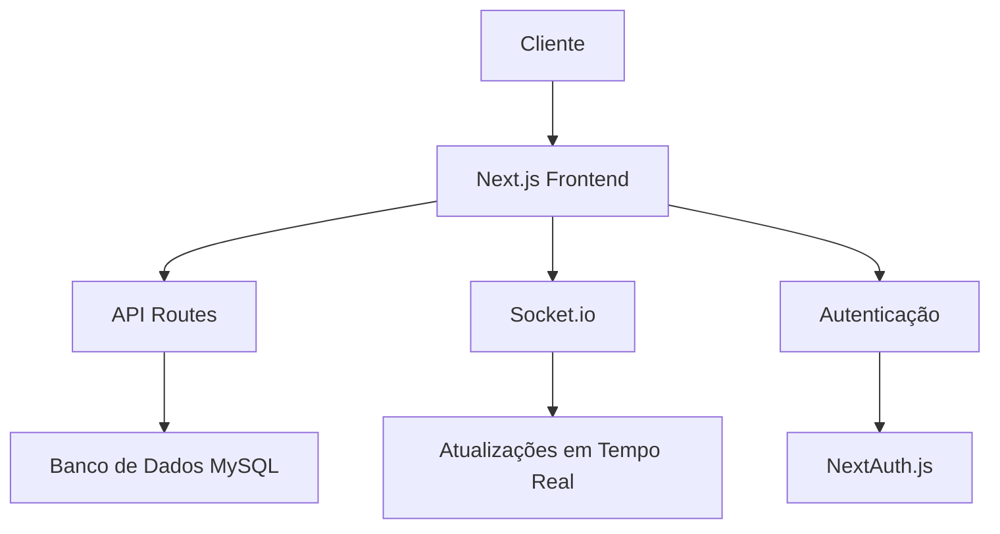
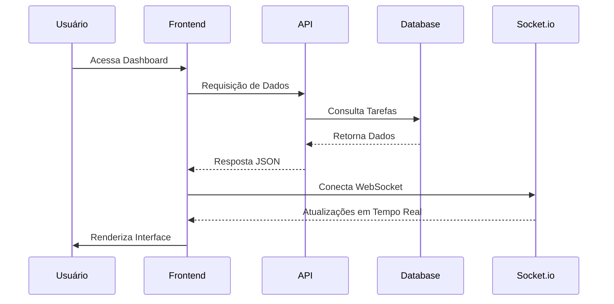

# Documentação do Sistema de Gestão Kanban

## Visão Geral
Este é um sistema de gestão Kanban desenvolvido com Next.js, utilizando tecnologias modernas como:
- Next.js 15.1.0
- React 18.3.1
- TypeScript
- Tailwind CSS
- MySQL
- Socket.io para atualizações em tempo real

## Arquitetura do Sistema



## Fluxo de Dados



## Principais Funcionalidades

1. **Dashboard**
   - Visualização de tarefas em diferentes status
   - Gráficos de distribuição por etapa
   - Cards atribuídos por usuário
   - Atividades em desenvolvimento

2. **Autenticação**
   - Sistema de login seguro
   - Proteção de rotas
   - Gerenciamento de sessão

3. **Gestão de Tarefas**
   - Criação de tarefas
   - Atribuição de responsáveis
   - Movimentação entre status
   - Atualizações em tempo real

4. **Visualizações**
   - Gráfico de pizza para distribuição
   - Gráfico radar para atribuição
   - Stack de tarefas por usuário

## Estrutura do Projeto

```
gestao/
├── app/                # Rotas e páginas da aplicação
├── components/         # Componentes React reutilizáveis
├── lib/               # Bibliotecas e utilitários
├── server/            # Configurações do servidor
├── sql/               # Scripts SQL
├── types/             # Definições TypeScript
└── public/            # Arquivos estáticos
```

## Tecnologias Utilizadas

- **Frontend**
  - Next.js
  - React
  - TypeScript
  - Tailwind CSS
  - Radix UI
  - Framer Motion
  - Recharts

- **Backend**
  - Node.js
  - MySQL
  - Socket.io
  - NextAuth.js

- **Ferramentas**
  - ESLint
  - PostCSS
  - Turbopack

## Status das Tarefas

1. Não iniciada
2. Em desenvolvimento
3. Em testes
4. Concluída

## Requisitos do Sistema

- Node.js
- MySQL
- Navegador moderno com suporte a JavaScript 